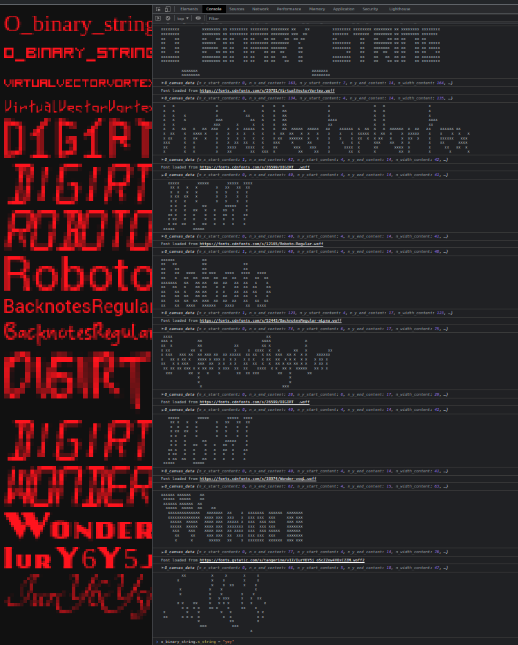

# O_binary_string
```
xxxxx       xxxxx x xxxxx xxxxx xxxxx x   x       xxxxx xxxxx xxxxx x xxxxx xxxxx 
x   x       x   x x x   x x   x x   x  x x        x       x   x   x x x   x x     
x   x       xxxx  x x   x xxxxx xxxxx   x         xxxxx   x   xxxxx x x   x x xxx 
x   x       x   x x x   x x   x x  x    x             x   x   x  x  x x   x x   x 
xxxxx       xxxxx x x   x x   x x   x   x         xxxxx   x   x   x x x   x xxxxx 
                                                                                  
      xxxxx                                 xxxxx                                 
```




# Browser javascript 

```javascript
var n_font_size = 10
var s_string = "Axy!`"
const o_binary_string = new O_binary_string(s_string, n_font_size)
console.log(o_binary_string.s_binary_text)
```
logs the following 
```
                           x 
   xx                xx     x
   xx                xx      
   xx   x  x xx  xx  xx      
  x  x   xx   x  x   xx      
  xxxx   xx   x  x           
  x  x   xx    xx            
 x    x x  x   xx    xx      
               x             
             xxx          
```
## change threshhold
the threshold controls how much of the font will be visible, foreach FontFace there is a best threshhold value
```javascript
o_binary_string.n_threshhold = 0.0
console.log(o_binary_string.s_binary_text)
```
logs the following, because threshhold is set to 0.0
```
                          xx
  xx                xx    xx
 xxxx               xx      
 xxxx xxxxxxxx  xx  xx      
 xxxx  xxxx xxx xx  xx      
xxxxxx  xx   xxxx   xx      
xx  xx xxxx  xxxx           
xx  xxxxxxxx  xx    xx      
              xx            
            xxx             
```

## change font face  
a very good font face is [visitor1](https://fonts.cdnfonts.com/s/7338/visitor1.woff)

```javascript
var s_font_url = "https://fonts.cdnfonts.com/s/7338/visitor1.woff"
await o_binary_string.f_load_font(s_font_url)
console.log(o_binary_string.s_binary_text)
```

# Deno 
because of the not supported `document.createElement("canvas")` and the not supported `new FontFace(...)` on denojs, `O_binary_string` works only with a simple 'arial' font. nonetheless it works!

```javascript
new O_binary_string("O_binary_string", 15)
```
logs 
```
xxxx        x       x                                                     x              
 x  x        x                                                x                           
xx  xx       xxxx  xxx   xxxx  xxxx  xxxx xx  xx       xxxx  xxxx  xxxx  xxx   xxxx  xxxx 
xx  xx       x  x    x   x  x     x  xx    x  x        x      x    xx      x   x  x  x  x 
xx  xx       x  x    x   x  x  xxxx  x     x  x         xx    x    x       x   x  x  xxxx 
 x  x        x  x    x   x  x  x  x  x      xx            x   x    x       x   x  x  x    
 xxxx        xxxx  xxxx  x  x  xxxx  x      xx         xxxx   xxx  x     xxxx  x  x  xxxx 
                                            x                                       xx  xx
      xxxxxx                              xxx   xxxxxx                               xxxx 
```